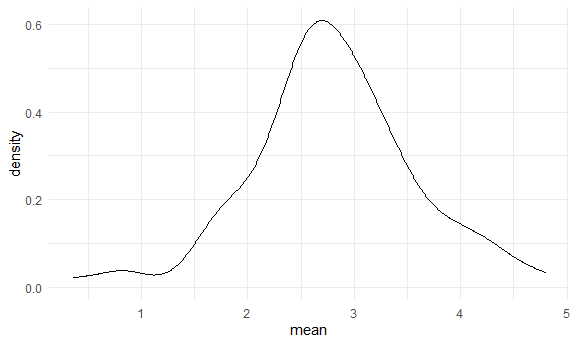
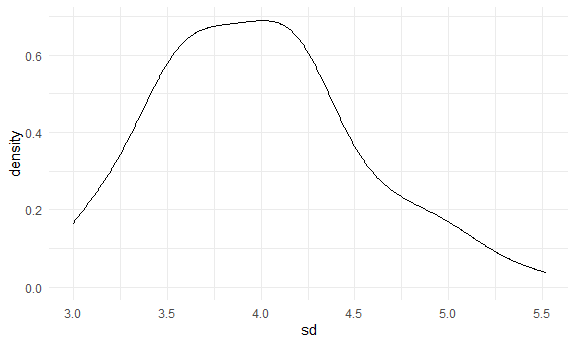

Simulation
================
Yu
November 10, 2020

``` r
library(tidyverse)
```

    ## -- Attaching packages ----------------------------------------------------------------------------------------------------------- tidyverse 1.3.0 --

    ## v ggplot2 3.3.2     v purrr   0.3.4
    ## v tibble  3.0.1     v dplyr   1.0.2
    ## v tidyr   1.1.0     v stringr 1.4.0
    ## v readr   1.3.1     v forcats 0.5.0

    ## -- Conflicts -------------------------------------------------------------------------------------------------------------- tidyverse_conflicts() --
    ## x dplyr::filter() masks stats::filter()
    ## x dplyr::lag()    masks stats::lag()

``` r
library(rvest)
```

    ## Loading required package: xml2

    ## 
    ## Attaching package: 'rvest'

    ## The following object is masked from 'package:purrr':
    ## 
    ##     pluck

    ## The following object is masked from 'package:readr':
    ## 
    ##     guess_encoding

Let's simulate something
------------------------

I have a function

``` r
sim_mean_sd = function(samp_size, mu = 3, sigma = 4){
  
  sim_data = 
    tibble(
      x = rnorm(n = samp_size, mean = mu, sd = sigma )
  )
sim_data %>% 
  summarize(
    mean = mean(x),
    sd = sd(x)
  )
  
}
```

I can 'simulate' by running line.

``` r
sim_mean_sd(30)
```

    ## # A tibble: 1 x 2
    ##    mean    sd
    ##   <dbl> <dbl>
    ## 1  3.32  4.29

Let's simulate a lot
--------------------

let's start wih a for loop.

``` r
output = vector('list', length = 100)

for (i in 1:100){
  
  output[[i]] = sim_mean_sd(30)
}

bind_rows(output)
```

    ## # A tibble: 100 x 2
    ##     mean    sd
    ##    <dbl> <dbl>
    ##  1  2.98  4.17
    ##  2  4.27  4.39
    ##  3  3.18  4.24
    ##  4  2.52  3.47
    ##  5  3.74  3.41
    ##  6  2.31  3.84
    ##  7  3.49  3.54
    ##  8  2.06  3.13
    ##  9  2.96  4.78
    ## 10  3.22  3.90
    ## # ... with 90 more rows

Let's use a loop function.

``` r
sim_results = 
  rerun(100, sim_mean_sd(30)) %>% 
  bind_rows()
```

Let's look at results...

``` r
sim_results %>% 
  ggplot(aes(x = mean)) + geom_density()
```



``` r
sim_results %>% 
  summarize(
    avg_sample_mean = mean(mean),
    sd_sample_mean = sd(mean)
  )
```

    ## # A tibble: 1 x 2
    ##   avg_sample_mean sd_sample_mean
    ##             <dbl>          <dbl>
    ## 1            2.80          0.777

``` r
sim_results %>% 
  ggplot(aes(x = sd)) + geom_density()
```


