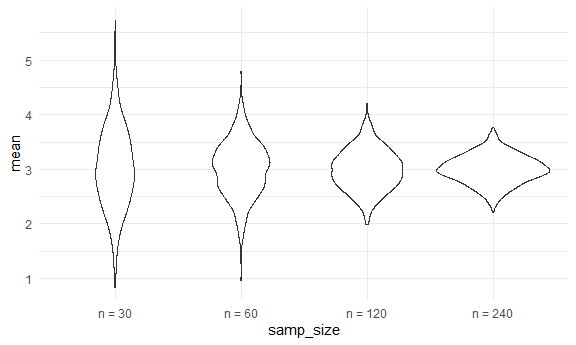

Simulation
================
Yu
November 10, 2020

``` r
library(tidyverse)
```

    ## -- Attaching packages ----------------------------------------------------------------------------------------------------------- tidyverse 1.3.0 --

    ## v ggplot2 3.3.2     v purrr   0.3.4
    ## v tibble  3.0.1     v dplyr   1.0.2
    ## v tidyr   1.1.0     v stringr 1.4.0
    ## v readr   1.3.1     v forcats 0.5.0

    ## -- Conflicts -------------------------------------------------------------------------------------------------------------- tidyverse_conflicts() --
    ## x dplyr::filter() masks stats::filter()
    ## x dplyr::lag()    masks stats::lag()

``` r
library(rvest)
```

    ## Loading required package: xml2

    ## 
    ## Attaching package: 'rvest'

    ## The following object is masked from 'package:purrr':
    ## 
    ##     pluck

    ## The following object is masked from 'package:readr':
    ## 
    ##     guess_encoding

Let's simulate something
------------------------

I have a function

``` r
sim_mean_sd = function(samp_size, mu = 3, sigma = 4){
  
  sim_data = 
    tibble(
      x = rnorm(n = samp_size, mean = mu, sd = sigma )
  )
sim_data %>% 
  summarize(
    mean = mean(x),
    sd = sd(x)
  )
  
}
```

I can 'simulate' by running line.

``` r
sim_mean_sd(30)
```

    ## # A tibble: 1 x 2
    ##    mean    sd
    ##   <dbl> <dbl>
    ## 1  2.16  4.03

Let's simulate a lot
--------------------

let's start wih a for loop.

``` r
output = vector('list', length = 100)

for (i in 1:100){
  
  output[[i]] = sim_mean_sd(30)
}

bind_rows(output)
```

    ## # A tibble: 100 x 2
    ##     mean    sd
    ##    <dbl> <dbl>
    ##  1  3.07  3.78
    ##  2  3.17  3.63
    ##  3  4.25  4.26
    ##  4  3.32  3.59
    ##  5  2.96  4.36
    ##  6  3.22  3.91
    ##  7  3.55  5.10
    ##  8  3.24  4.12
    ##  9  2.77  4.66
    ## 10  2.78  3.69
    ## # ... with 90 more rows

Let's use a loop function.

``` r
sim_results = 
  rerun(100, sim_mean_sd(30)) %>% 
  bind_rows()
```

Let's look at results...

``` r
sim_results %>% 
  ggplot(aes(x = mean)) + geom_density()
```


``` r
sim_results %>% 
  summarize(
    avg_sample_mean = mean(mean),
    sd_sample_mean = sd(mean)
  )
```

    ## # A tibble: 1 x 2
    ##   avg_sample_mean sd_sample_mean
    ##             <dbl>          <dbl>
    ## 1            2.86          0.723

``` r
sim_results %>% 
  ggplot(aes(x = sd)) + geom_density()
```


Let's try other sample sizes.
-----------------------------

``` r
n_list = 
  list(
    'n = 30' = 30,
    'n = 60' = 60,
    'n = 120' = 120,
    'n = 3240' = 240
  )

output = vector('list', length = 4)

output[[1]] = rerun(100, sim_mean_sd(samp_size = n_list[[1]])) %>% bind_rows()

for(i in 1:4){
  
  output[[i]] = 
    rerun(100, sim_mean_sd(samp_size = n_list[[i]])) %>% 
    bind_rows()
}
```

``` r
sim_results = 
  tibble(
  samp_size = c(30, 60, 120, 240)
) %>% 
  mutate(
    output_lists = map(.x = samp_size, ~ rerun(1000, sim_mean_sd(.x))),
    estimate_df = map(output_lists, bind_rows)
  ) %>% 
  select(-output_lists) %>% 
  unnest(estimate_df)
```

Do some data frame things.

``` r
sim_results %>% 
  mutate(
    samp_size = str_c('n = ', samp_size),
    samp_size = fct_inorder(samp_size)
  ) %>% 
  ggplot(aes(x = samp_size, y = mean))+
  geom_violin()
```



``` r
sim_results %>% 
  group_by(samp_size) %>% 
  summarize(
    avg_mean = mean(mean),
    sd_samp_mean = sd(mean)
)
```

    ## `summarise()` ungrouping output (override with `.groups` argument)

    ## # A tibble: 4 x 3
    ##   samp_size avg_mean sd_samp_mean
    ##       <dbl>    <dbl>        <dbl>
    ## 1        30     3.01        0.733
    ## 2        60     3.01        0.507
    ## 3       120     2.99        0.374
    ## 4       240     3.00        0.263
